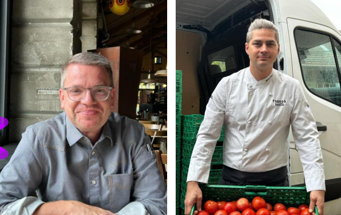

+++
title = "Reportage zu Food Waste in der Gastronomie"
date = "2024-06-18"
draft = false
pinned = false
footnotes = ""
+++
# Auf dem Weg zu nachhaltigem Genuss

### *Der Müllberg, der zwischen Hygienemassnahmen und gesellschaftlichen Ansprüchen, wirtschaftlichem Erfolg und Umweltschutz entsteht.*

Das Letzte, was man sieht, ist das Feld des Bauern, Karotten überall. Es wird dunkel, Szenenwechsel. Die Schauspieler huschen wie Schatten an den Wänden über die Bühne. Die Teller werden so leise wie möglich hingestellt. Plötzlich gehen die Scheinwerfer wieder an. Die Bühne bekommt innerhalb weniger Sekunden eine 180 Grad Drehung verpasst. Wir sehen jetzt in den Innenraum eines Gasthauses. Das Licht ist warm und gedimmt. Die je zwei Kerzen auf den Holztischen geben dem Gasthaus ein heimeliges Ambiente. Es herrscht ein geschäftiges Treiben und aufgeregtes Stimmengewirr. Die Wanduhren zeigen 19 Uhr 45 an. Hinter den Kulissen werden die nicht verwendeten Karotten wieder in die Erde zurückgesteckt und das übriggebliebene Brot nur mal eben abgewischt, bevor es auf der Bühne, auf einem saubergeleckten Teller wieder zum Vorschein kommt. Das Theater lässt den Traum eines Disneyrestaurants wahr werden. Hier wird nur der Speisesaal gezeigt, denn die Zuschauer wollen die Realität nicht sehen. Diese sieht anders aus. Das Stück in unserer Welt hat noch nicht geendet, wenn die halbvollen Teller zurück in die Küche wandern.

#### Die unverarbeitete Karotte

Der Weg der Karotte beginnt auf dem Feld eines Bauern. Seit Juni könnte sie geerntet werden und heute ist ihr Moment gekommen. Die Karotte wird geerntet, so wie die umliegenden Karotten. Jedoch entspricht ein zu beachtender Teil nicht der Norm. So auch die Nachbarskarotte. Aus diesem Grund werden in der Schweiz jährlich 29000 Tonnen Gemüse weggeworfen. Das sind umgerechnet etwa 58 Mio. 500g Karottenpackungen, die im Migros erhältlich sind. Die Nachbarskarotte hat jedoch noch eine Chance. FooDoo, gegründet von Mirko Buri, könnte sie noch retten und zu einer leckeren Panjabi Sauce verarbeiten. Jährlich produziert FooDoo 70'000 Tonnen Gemüsesauce und Boullion aus nicht perfektem oder überschüssigem Gemüse in wiederverwendbaren Gläsern. Aus der ausnormierten Nachbarskarotte kann hier ein «No Food Waste Reminder» geschaffen werden. Auch wenn dies etwas paradox scheint, schliesslich verkauft FooDoo Saucen aus nicht perfektem Gemüse an die Kunden, die das nicht perfekte Gemüse nicht gekauft haben. Das «Erinnern» kann laut Herrn Buri, dazu beitragen, dass Lebensmittelverschwendung in den Köpfen der Menschen ankommt und sie sich damit auseinandersetzen. Gemäss seinen Aussagen sei es sehr wichtig, die Menschen auf diese Problematik aufmerksam zu machen. Damit wäre ein Umdenken und ein Wandel in der Gesellschaft möglich. Das sei der erste wichtige Schritt.

Zurück zu den Karotten vom Anfang. Von den nicht ausrangierten Karotten landen einige in den orangen 1 kg Plastiktaschen, die man aus Supermärkten, wie Coop und Migros, kennt. Werden sie dort vor ihrem Verfallsdatum nicht gekauft, so werden sie weggeworfen. Ihre einzige Rettung sind Plattformen gegen Food Waste wie Foodsharing oder Too Good To Go, wo sie günstig erworben werden können. Konzepte wie diese gehen momentan auf den sozialen Medien viral. Auch Mirko Buri ist Fan von diesen Apps. Er meint, dass sie skalierbar seien und eine grosse Reichweite hätten. Gut sei das Konzept vor allem für Lebensmittelläden, welche unverarbeitete Produkte auf diese Art und Weise verkaufen können. Für Restaurants, welche die Produkte «verkochen», sei dies aber schwierig umsetzbar. 

***«Sollen sie das übrige Kartoffelgratin einfach vor die Türe stellen und die Leute kommen und schöpfen sich ihren Teil raus?»***

Letztendlich lösen die Apps das eigentliche Problem jedoch nicht. Befürchten tut er in gewissen Fällen eine Umkehrreaktion. Es werde oft absichtlich überproduziert, damit etwas auf Too Good To Go verkauft werden könne und man sich als «nachhaltig» verkaufen könne. Auch bei den Karotten könne dies geschehen. Der eine Bauer verkauft krumme Karotten, die entstanden sind, weil er die Steine nicht aus der Erde holen wollte, während der Nachbar mühselig die Steine aus dem Boden gehoben hat, um Karotten verkaufen zu können, welche der Norm entsprechen.

#### Die Verarbeitung der Karotte

Unsere knackige, gerade Karotte, frisch vom Feld des Bauerns, kommt in
eine grüne Harasse zusammen mit vielen anderen Karotten. Sie wird in einen Laster geladen, welcher sich auf den Weg zum Bärengraben macht.

Mit einem lauten Krach fällt die Anhängertür des Transporters runter. Harasse um Harasse wird in Eile vom Lastwagen gehoben. Die Karotten mittendrin auf dem Weg in die Küche des Tramdepots.

Es ist morgens um halb elf. Im Speisesaal ist es noch ruhig, aber im Hintergrund laufen die Vorbereitungen für das kommende Mittagessen auf Hochtouren, viele Köche stehen am Herd und um verschiedene Töpfe herum. Damit vor und während der Stosszeiten im Restaurant alles rund läuft und alle Gäste ihr gewünschtes Essen serviert bekommen, braucht es eine Person für die Planung und die Erledigung der Aufgaben im Hintergrund. Enrico Richter arbeitet seit drei Jahren als Küchenchef im Tramdepot. Er meint, dass Food Waste schon immer ein viel diskutiertes Thema in der Branche gewesen sei. Jedoch werde seit einigen Jahren mehr darauf geachtet, weniger zu verschwenden. Der erfahrene Koch hat viel zu erzählen und eine Menge Erfahrungen bezüglich Lebensmittelverschwendung zu teilen. Die Masse an Verschwendung von Esswaren in unserer Gesellschaft sei enorm.

***«Eine Vollkatastrophe!»***

In der Küche werden die Karotten nun gründlich gewaschen. Sie warten auf ihre Verarbeitung. Hoffentlich werden sie alle verwendet. Viele ihrer Artgenossen schaffen es aufgrund von ungenügender Qualität oder Falschbestelllungen nicht auf den Teller. Unsere Möhren bangen so lange auf eine Chance, bis auch sie ihr Mindesthaltbarkeitsdatum überschreiten. Enrico Richter wirkt diesen Aspekten entgegen, indem er Bauern für einen günstigeren Preis auch das aus der Norm tanzende Gemüse abkauft. Die Karotten haben also Glück. Sie haben eine weitere Hürde überwunden. Nun werden sie in die gewünschte Form gebracht. Geschält, gewürfelt, püriert und geraffelt. Dabei entstehen Berge von Rüstabfällen. Das Tramdepot bringt die nicht verwendeten Ressourcen in eine Biogasanlage. Die Karotten warten nun sehnsüchtig auf das Anrichten. Wie sehr wünschen sie sich auf einem dieser Teller zu landen. Einige Möhrenstücke haben Pech. Der Abend ist bald zu Ende und sie befinden sich noch immer in der Küche. Diese Karotten wurden umsonst angerichtet und landen nun doch noch auf dem Komposthaufen. Eine Überproduktion wird im Tramdepot durch ein Mise en Place grösstenteils vermieden.

#### Die Karotte beim Gast

Unsere Karotte hat es geschafft. Sie landet auf dem Herbstblattsalat vor unseren strahlenden Gesichtern. Sie wird mit vollem Genuss verspeist. Doch es sieht nicht überall so aus. Die Möhre am Nachbarstisch wurde fälschlicherweise serviert. Dieser Herbstsalat wird vom Gast abgewiesen. Für die Möhre bedeutet dieser Entscheid ein böses Ende. Sobald das Gericht einmal beim Gast war, bleibt dem Personal nichts anderes übrig, als das übriggebliebene Essen zu entsorgen.

***«Schliesslich könnte es ja sein, dass jemand darauf geniesst hat.»***

Solche Szenen brechen Enrico Richter und uns das Herz. Vor allem weil keine andere Alternative als die Entsorgung besteht.

Food Waste ist in der Gastronomie oftmals ein unausweichliches Übel. Als jemand, der das Essen sehr schätzt, ist es Enrico Richter wichtig, Lösungen und Alternativen für Food Waste zu finden. Er ist der Gastrobranche treu geblieben, um etwas verändern zu können. Jedoch liegen auch dem Küchenchef in FooDoo, Mirko Buri, die krummen Karotten sehr am Herzen. Er ist vor acht Jahren aus der Branche ausgestiegen, um sein Start-Up zu verwirklichen. Heute gibt er Seminare, um Restaurantbetrieben auf ihrem Weg zu einem nachhaltigeren Genuss zu helfen.

#### Was wir von unserer Karotte lernen

Lebensmittelverschwendung in dem Ausmass, wie es sie momentan bei uns in der Schweiz gibt, ist immens. Sie ist eine Vollkatastrophe. Ein Drittel des Essens wird weggeworfen, verschwendet. Meist wäre es noch essbar gewesen. Doch warum sind die Zahlen so hoch? Vergleicht man die Zahlen der Schweiz mit denen weltweit, so fällt auf: Es sind vor allem die westlichen Länder wie die Schweiz, die solche Lebensmittel-Müllberge produzieren. Ganz einfach, weil wir es uns leisten können. Da sind Mirko Buri und Enrico Richter einer Meinung. Der Küchenchef aus dem Tramdepot findet, die Politik solle die Vorschriften für Restaurants lockern. Die Hygienemassnahmen seien viel zu streng, führen zu überflüssigem Food Waste und seien zudem auch nicht gut für unser Immunsystem. «Sobald es einmal ein bisschen kalt wird, sind gleich alle krank.» Mirko Buri meint jedoch, dass man an erster Stelle am Bewusstsein der Konsumenten arbeiten solle. Die «Rüebli» sollen mehr wertgeschätzt werden. Über die Generationen hinweg erkenne man ein gewisses Muster. Unsere Grosseltern sind während des Kriegs, beziehungsweise in der Nachkriegszeit aufgewachsen. Bei ihnen sehe man oft, dass sie bewusst leben. Einkaufsliste, Seniorenteller und die 500 Gramm Karottentüte. Auf sie folgt die Generation unserer Eltern, die Generation X. Sie sind in einer Zeit aufgewachsen, in der die schweren Zeiten vorbei waren. Sie kennen die Zeit des aufkommenden Wohlstands der zu steigendem Konsum geführt hat, auch in der Gastrobranche. Die Konsequenzen dieses Handelns waren damals nicht erforscht und wurden folglich nicht erkannt. Wir, die Generation Z, aber wachsen mit dem Wissen über die Konsequenzen auf und werden noch am längsten mit ihren Auswirkungen leben müssen. Wenn wir lernen, dass, obwohl wir alles im Überfluss haben können, wir nicht alles haben müssen, so können wir laut Mirko Buri, viel bewirken. Wir denken, dass ein Wandel in der Gesellschaft einen Wandel in der Politik bewirken wird und wir so letzten Endes mehr «Rüebli» retten können.